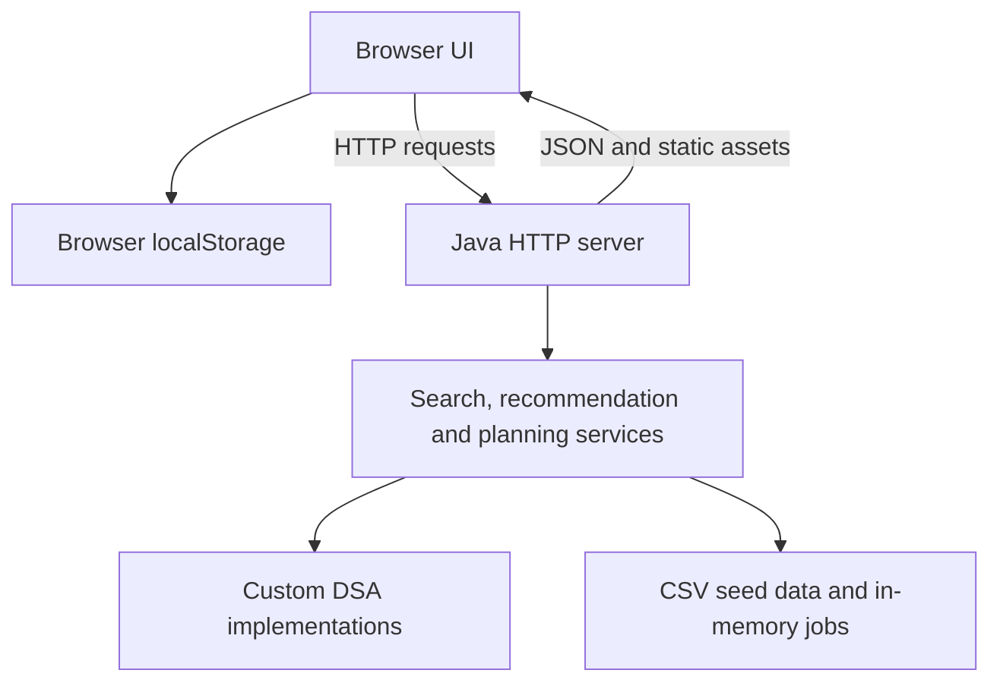

# Intelligent Job Portal — NovaHire V4

**DSA-3 project · KLH CSE · Team 9 · Academic year 2026–2027**

NovaHire is a Java-based intelligent job portal that helps candidates search for suitable roles, understand their skill gaps, and plan applications within a limited time budget. Its search, recommendation, and planning services use custom implementations of advanced data structures and algorithms.

The V4 web edition includes Job Seeker, Recruiter, and Administrator views, with a separate console edition for demonstrating the algorithmic workflows.

## Contents

- [Features](#features)
- [Technology stack](#technology-stack)
- [Architecture](#architecture)
- [Algorithms and data structures](#algorithms-and-data-structures)
- [Recommendation scoring](#recommendation-scoring)
- [Repository layout](#repository-layout)
- [Setup and execution](#setup-and-execution)
- [API reference](#api-reference)
- [Data and persistence](#data-and-persistence)
- [Project demonstration](#project-demonstration)
- [Verification](#verification)
- [Troubleshooting](#troubleshooting)
- [Project resources](#project-resources)

## Features

### Job Seeker

- Search jobs by role, skill, company, or location, with filters for work mode, experience, salary, and job type.
- Recover close title matches when exact search returns no results.
- Receive ranked job recommendations based on skills, preferred location, and target role.
- Inspect match percentages, matched skills, missing skills, and the reasons for a recommendation.
- Save opportunities and compare up to three jobs.
- Record applications locally and view an application pipeline.
- Explore career insights and Opportunity Lens views for fit, growth, salary, and competition.
- Use **Skill Unlock** to identify a small set of additional skills to learn.
- Use **Application Strategy** to choose promising jobs within a weekly application-time budget.
- Edit profile preferences and refresh recommendations.

### Recruiter

- Publish a job through the Java backend; the new opening becomes searchable immediately.
- Browse openings and sample candidate profiles.
- Sort the sample applicants and use **Anonymous Candidate Mode** to hide their names.
- View demonstration applicant and interview dashboards.

### Administrator

- View demonstration platform dashboards, employer-verification queues, and reports.
- Open local review controls for illustrating the administration workflow.

**Implementation scope:** NovaHire V4 is a local academic demonstration. The role selector changes the interface; account authentication and access control are not implemented. Recruiter applicant scores, interview entries, employer badges, competition indicators, and administration records use sample or derived data. Shortlisting and review buttons provide interface feedback. Candidate applications are stored in the browser, rather than submitted to an employer service.

## Technology stack

| Layer | Implementation |
| --- | --- |
| Backend language | Java; JDK 17 or later |
| HTTP server | JDK `jdk.httpserver` module, using `com.sun.net.httpserver.HttpServer` |
| Frontend | HTML, CSS, and vanilla JavaScript |
| Browser/server communication | JavaScript Fetch API, HTTP parameters, and JSON responses |
| Job data | `data/jobs.csv`, loaded into a custom in-memory repository |
| Browser persistence | `localStorage` for profile, saved jobs, applications, and selected role |
| Algorithm engine | Custom Java implementations under `algorithms/` |
| Launchers | Windows batch and PowerShell scripts |
| Verification | Included Java `SelfTest` suite |

The application runs directly on the JDK. It has no package-install or database-server setup step.

## Architecture



[WebMain.java][web-main] loads the CSV dataset and starts [PortalHttpServer.java][http-server]. The server serves the frontend and routes API requests to Java services. The services use the same job collection, so recruiter-created jobs are available to search and recommendation during the current server session.

The server binds to `127.0.0.1` for local desktop use.

## Algorithms and data structures

These implementations can be inspected in the [algorithm source directory][algorithms]. Some power the main web interface; others are exposed through dedicated APIs or the console edition for academic demonstrations.

| Algorithm | Purpose in this implementation | Entry point |
| --- | --- | --- |
| Knuth–Morris–Pratt (KMP) | Exact substring search across job text; also checks target-title matches | Main job search and `/api/search?algo=kmp` |
| Z Algorithm | Alternative exact string search and comparison with KMP | `/api/search?algo=z`, benchmark, console |
| Rabin–Karp | Rolling-hash substring search with verification of hash matches | `/api/search?algo=rabin-karp`, benchmark, console |
| Aho–Corasick | Matches multiple candidate skills against required job skills with explicit skill boundaries | Recommendation scoring |
| Suffix Array and LCP | Builds an index over the job corpus for substring queries and longest-common-prefix analysis | `/api/suffix`, console |
| Wagner–Fischer edit distance | Supports typo recovery and location/title similarity | Fuzzy search and recommendation scoring |
| Bitmask/subset-state dynamic programming | Selects missing skills within a skill-count budget to improve coverage of shortlisted jobs | Skill Unlock and `/api/skill-plan` |
| Edmonds–Karp maximum flow | Maximizes feasible candidate assignments subject to a minimum match threshold and vacancy capacity | `/api/allocate`, console |
| Exact 0/1 knapsack DP | Selects applications within an hour budget using match scores as values and application hours as costs | Application Strategy and `/api/optimize` |
| Density-greedy/best-single approximation | Provides a comparison plan alongside the exact knapsack result | `/api/optimize`, console |
| Randomized QuickSort | Sorts backend recommendation results by descending match score | Recommendation engine |
| Reservoir sampling | Selects a bounded random sample of jobs | `/api/featured`, console |
| Parallel reduction | Splits salary-value summation among worker threads and checks it against a sequential sum | `/api/parallel`, console |
| Linear congruential generator | Supplies pseudorandom choices for QuickSort pivots and reservoir sampling | `LCGRandom.java` |

The skill planner considers up to eight ranked jobs and a bounded universe of 15 missing skills. The web application optimizer considers the top 12 ranked jobs. Allocation maximizes the number of feasible assignments; it does not optimize the total match score.

| Custom structure | Use |
| --- | --- |
| `DynamicArray` | Stores the job corpus and search results |
| `IntQueue` | Supports Aho–Corasick failure-link construction and Edmonds–Karp BFS |
| `CustomHashTable` | Included and checked by the self-test suite as a separate data-structure implementation |

Frontend display filters and sample applicant sorting also use JavaScript's native array operations.

## Recommendation scoring

[JobRecommendationEngine.java][recommendation] calculates:

```text
Match score = 0.60 × skill score
            + 0.25 × location score
            + 0.15 × title score
```

- **Skill score:** percentage of the job's required skills covered by the candidate. Exact boundaries prevent a skill such as Java from matching JavaScript.
- **Location score:** 100 for an exact location match; otherwise an edit-distance similarity score. An unspecified location receives a neutral score of 50.
- **Title score:** 100 when the desired title is a substring of the job title; otherwise edit-distance similarity. An unspecified title receives a neutral score of 50.

Results are clamped to 0–100 and ranked using Randomized QuickSort. Additional candidate skills do not reduce required-skill coverage. The API also returns component scores, matched skills, and missing skills.

These percentages express the project's scoring rules, rather than a probability of being hired.

## Repository layout

The executable application is inside this nested directory:

```text
Project/IntelligentJobPortal-DSA3-v4-Final/IntelligentJobPortal-DSA3-v4-Final/IntelligentJobPortal-DSA3-v4
```

| Path, relative to the executable project folder | Contents |
| --- | --- |
| `src/com/dsa/jobportal/Main.java` | Console entry point |
| `src/com/dsa/jobportal/SelfTest.java` | Included verification suite |
| `src/com/dsa/jobportal/web/` | HTTP server, routes, static-file serving, and web entry point |
| `src/com/dsa/jobportal/service/` | Repository, search, recommendation, allocation, and algorithm-selection services |
| `src/com/dsa/jobportal/model/` | `Job`, `Candidate`, and `MatchResult` classes |
| `src/com/dsa/jobportal/algorithms/` | String, DP, flow, optimization, randomized, and parallel algorithms |
| `src/com/dsa/jobportal/structures/` | Custom array, queue, and hash table |
| `web/index.html` | Page structure and role-specific views |
| `web/assets/app.js` | API calls, rendering, filters, browser state, and user actions |
| `web/assets/styles.css` | Layout, styling, and responsive rules |
| `data/jobs.csv` | 30 seed job records |
| `docs/` | Project overview and packaged verification report |
| `run-web.bat`, `run-web.ps1` | Web launchers |
| `run.bat`, `run.ps1` | Console launchers |
| `START_HERE.txt` | Quick-start instructions |

## Setup and execution

### Prerequisites

- JDK 17 or later, with both `java` and `javac` available on `PATH`.
- A modern web browser.
- VS Code is convenient for editing and running the project.
- Git is needed only if cloning; downloading the repository ZIP is also supported.

Check Java in a terminal:

```powershell
java -version
javac -version
```

### Windows / VS Code

1. Clone the repository:

```powershell
git clone https://github.com/abhaytripathi-cj7/KLH_CSE_2026-2027_S6_Team9_Intelligent_job_portal.git
cd KLH_CSE_2026-2027_S6_Team9_Intelligent_job_portal
cd Project/IntelligentJobPortal-DSA3-v4-Final/IntelligentJobPortal-DSA3-v4-Final/IntelligentJobPortal-DSA3-v4
```

If using **Code → Download ZIP**, extract it and open the nested application folder listed above.

2. Open that application folder in VS Code and open **Terminal → New Terminal**.
3. Start the web edition:

```powershell
.\run-web.bat
```

The launcher compiles the Java sources, runs the included self-tests, and starts the server. Expected self-test output:

```text
Self-test passed: 32/32
```

4. Open the address printed in the terminal, normally [http://localhost:8080](http://localhost:8080). The server attempts to open the browser automatically.

When the default port is busy, startup tries ports 8081–8089. Use the printed address. To request a specific port:

```powershell
.\run-web.bat 8090
```

The PowerShell launcher is also available:

```powershell
.\run-web.ps1 -Port 8090
```

Stop the server with **Ctrl+C**.

### Linux / macOS

From the same nested application folder, compile and verify:

```bash
mkdir -p out
find src -name '*.java' > sources.txt
javac --add-modules jdk.httpserver -encoding UTF-8 -d out @sources.txt
java --add-modules jdk.httpserver -cp out com.dsa.jobportal.SelfTest
```

Start the web edition:

```bash
java --add-modules jdk.httpserver -cp out com.dsa.jobportal.web.WebMain
```

An optional final argument selects the port:

```bash
java --add-modules jdk.httpserver -cp out com.dsa.jobportal.web.WebMain 8090
```

### Console edition

On Windows:

```powershell
.\run.bat
```

On Linux/macOS, after compilation:

```bash
java --add-modules jdk.httpserver -cp out com.dsa.jobportal.Main
```

The console edition exposes search, recommendations, indexing, skill planning, allocation, optimization, sampling, and algorithm comparisons.

## API reference

Use the port printed by the server. The following table shows the intended request methods and main parameters.

| Method | Endpoint | Main parameters | Purpose |
| --- | --- | --- | --- |
| GET | `/api/health` | — | Server status, version, and loaded-job count |
| GET | `/api/insights` | — | Job, company, location, vacancy, and salary statistics |
| GET | `/api/jobs` | `limit` | Read the current job corpus |
| POST | `/api/jobs` | `title, company, location, skills, description`; optional `salary, experience, vacancies, applyHours, workMode` | Add a job to the running server |
| GET | `/api/search` | `q, algo` | Exact job-text search; `algo` accepts `kmp`, `z`, or `rabin-karp` |
| GET | `/api/fuzzy` | `q, distance` | Find close title matches |
| GET | `/api/recommend` | `name, skills, location, title, limit` | Ranked jobs and scoring explanations |
| GET | `/api/skill-plan` | `name, skills, location, title, budget` | Suggested missing skills and projected utility |
| GET | `/api/benchmark` | `q` | Compare KMP, Z, and Rabin–Karp measurements |
| GET | `/api/suffix` | `q` | Corpus-index lookup and LCP statistics |
| GET | `/api/featured` | `k` | Reservoir-sampled jobs |
| GET or POST | `/api/allocate` | `count, threshold`; `name0, skills0, location0`, etc. | Candidate-to-vacancy allocation |
| GET or POST | `/api/optimize` | `name, skills, location, title, hours` | Exact and approximate application-time plans |
| GET | `/api/parallel` | `threads` | Parallel salary summation and sequential comparison |

POST requests use **`application/x-www-form-urlencoded`** bodies. In Postman, choose **Body → x-www-form-urlencoded**. Skills can be separated with commas or `|`; the server normalizes them.

Try these GET URLs in a browser or Postman after starting the server:

```text
http://localhost:8080/api/health
http://localhost:8080/api/search?q=Java&algo=kmp
http://localhost:8080/api/fuzzy?q=sofware&distance=3
http://localhost:8080/api/recommend?skills=Java%2CSpring%2CSQL%2CAWS&location=Hyderabad&title=Backend%20Developer
http://localhost:8080/api/optimize?skills=Java%2CSpring%2CSQL%2CAWS&location=Hyderabad&hours=8
```

For a job-publishing example, send **POST `/api/jobs`** with:

| Form key | Example value |
| --- | --- |
| `title` | Java Developer Demo |
| `company` | Demo Company |
| `location` | Hyderabad |
| `skills` | Java, SQL |
| `description` | Backend development demonstration role |
| `salary` | 10 |
| `experience` | 0 |
| `vacancies` | 1 |
| `applyHours` | 2 |
| `workMode` | Remote |

`salary` is expressed in LPA; `experience` is in years. Work mode accepts `Hybrid`, `Remote`, or `On-site`. Numeric parameters are bounded by the server. Successful API requests return JSON with `ok: true`; missing required input returns HTTP 400.

## Data and persistence

| Data | Storage | Lifetime |
| --- | --- | --- |
| Seed jobs | `data/jobs.csv` | Loaded again at server startup |
| Recruiter-created jobs | Java in-memory repository | Current server session |
| Profile and preferences | Browser `localStorage` | Persists for the same browser origin |
| Saved jobs and applications | Browser `localStorage` | Persists for the same browser origin |
| Selected role | Browser `localStorage` | Persists for the same browser origin |
| Comparison selection | JavaScript memory | Current page session |
| Applicant/interview/admin examples | Frontend sample data | Demonstration content |

The CSV columns are:

```text
id,title,company,location,skills,description,salaryLpa,experienceYears,vacancies,applyHours
```

The CSV reader splits on commas, so seed fields should not contain embedded commas; separate seed skills with `|`. Runtime job publishing preserves its work-mode value and leaves the seed CSV unchanged.

Restarting the Java server removes runtime-created jobs. Browser state is separate: changing the port changes the browser origin, so it can show a different set of saved preferences and applications. A browser-saved reference to a runtime-created job does not preserve that job on the server.

## Project demonstration

1. Start the web edition and show `/api/health`.
2. In **Job Seeker**, search for `Java`, then try `sofware` to demonstrate typo recovery.
3. Edit the profile's skills, location, or target title and refresh recommendations.
4. Open a job to explain its score and matched/missing skills.
5. Save opportunities and compare two or three jobs.
6. Run **Skill Unlock** and **Application Strategy**, using an eight-hour application budget.
7. Switch to **Recruiter**, publish a uniquely named demo job, and find it through job search.
8. Explain the sample candidate and administration views, then use the API or console to demonstrate maximum-flow allocation, indexing, benchmarking, and parallel reduction.

## Verification

The current repository source was checked on **5 October 2026** with Java 17:

- All 29 Java source files compiled successfully.
- The included self-test suite passed **32/32** checks.
- All 13 registered API paths returned successful responses with suitable inputs.
- The frontend was served successfully by the Java server.
- A job published through `POST /api/jobs` retained its work mode and became searchable immediately.
- The starting corpus contained **30 seed jobs**.

The self-tests cover string matching, edit distance, exact skill boundaries, recommendation ranking, skill planning, flow allocation, knapsack comparison, sampling, parallel reduction, custom structures, runtime job insertion, and selected frontend checks.

Run [SelfTest.java][self-test] after making source changes. The [packaged test report][test-report] provides additional project notes.

## Troubleshooting

| Symptom | Action |
| --- | --- |
| `java` or `javac` is not recognized | Install a full JDK, add its `bin` folder to `PATH`, restart VS Code, and check both version commands. |
| Launcher cannot be found | Open the nested application folder containing `src`, `web`, `data`, and `run-web.bat`. |
| PowerShell blocks `run-web.ps1` | Run the supplied `run-web.bat` launcher instead. |
| Port 8080 is occupied | Use the automatically selected address, or request another port with `run-web.bat 8090`. An explicitly requested port has no automatic fallback. |
| Browser does not open | Copy the address printed in the terminal into the browser. |
| Job data or frontend files cannot be found | Run from the application folder and check that `data/jobs.csv` and `web/index.html` exist. |
| Opening `index.html` directly causes API failures | Start the Java server and use its localhost address. |
| Published job disappears after restart | Runtime-created jobs last for the current Java server session. |
| Saved data differs after changing ports | Browser storage is specific to each origin, including its port. |
| Compilation reports unsupported language features | Check that both `java` and `javac` use JDK 17 or later. |

## Project resources

- [Application source and launchers][application]
- [Application README][application-readme]
- [Quick-start guide][quick-start]
- [Project overview][overview]
- [Packaged verification report][test-report]
- [Project abstract](Project/DSA3-Abstract.pdf)
- [Review 1 presentation](Project/DSA_Review1.pdf)
- [Final project presentation](Project/Intelligent_Job_Portal_Finalised.pptx)

[application]: Project/IntelligentJobPortal-DSA3-v4-Final/IntelligentJobPortal-DSA3-v4-Final/IntelligentJobPortal-DSA3-v4/
[application-readme]: Project/IntelligentJobPortal-DSA3-v4-Final/IntelligentJobPortal-DSA3-v4-Final/IntelligentJobPortal-DSA3-v4/README.md
[quick-start]: Project/IntelligentJobPortal-DSA3-v4-Final/IntelligentJobPortal-DSA3-v4-Final/IntelligentJobPortal-DSA3-v4/START_HERE.txt
[overview]: Project/IntelligentJobPortal-DSA3-v4-Final/IntelligentJobPortal-DSA3-v4-Final/IntelligentJobPortal-DSA3-v4/docs/PROJECT_OVERVIEW.md
[test-report]: Project/IntelligentJobPortal-DSA3-v4-Final/IntelligentJobPortal-DSA3-v4-Final/IntelligentJobPortal-DSA3-v4/docs/TEST_REPORT.md
[algorithms]: Project/IntelligentJobPortal-DSA3-v4-Final/IntelligentJobPortal-DSA3-v4-Final/IntelligentJobPortal-DSA3-v4/src/com/dsa/jobportal/algorithms/
[recommendation]: Project/IntelligentJobPortal-DSA3-v4-Final/IntelligentJobPortal-DSA3-v4-Final/IntelligentJobPortal-DSA3-v4/src/com/dsa/jobportal/service/JobRecommendationEngine.java
[web-main]: Project/IntelligentJobPortal-DSA3-v4-Final/IntelligentJobPortal-DSA3-v4-Final/IntelligentJobPortal-DSA3-v4/src/com/dsa/jobportal/web/WebMain.java
[http-server]: Project/IntelligentJobPortal-DSA3-v4-Final/IntelligentJobPortal-DSA3-v4-Final/IntelligentJobPortal-DSA3-v4/src/com/dsa/jobportal/web/PortalHttpServer.java
[self-test]: Project/IntelligentJobPortal-DSA3-v4-Final/IntelligentJobPortal-DSA3-v4-Final/IntelligentJobPortal-DSA3-v4/src/com/dsa/jobportal/SelfTest.java

